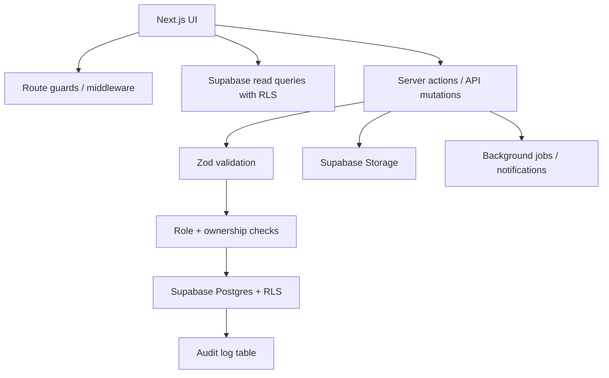

# Campus Pulse Engineering Audit

Audit date: 2026-07-12

## Executive summary

Campus Pulse is a compact Next.js 15 App Router application backed directly by Supabase Auth, Postgres/RLS, and Storage. The product is coherent and the production build passes, but the current architecture relies heavily on client-side Supabase calls, broad read policies, and UI-level validation. This is acceptable for a prototype or campus pilot, but not yet production-grade for privacy-sensitive campus operations.

This audit applied a small hardening pass:

- Restricted global frame/CORS security headers in `next.config.js`.
- Constrained auth callback redirects in `app/auth/callback/route.js`.
- Matched upload MIME validation to the Supabase bucket allowlist in `components/image-upload.jsx`.
- Added `supabase/migrations/004_production_hardening.sql` for database constraints, indexes, and task-capacity enforcement.
- Updated `README.md` with the new migration and optional CORS setting.

Validation performed: `yarn build` passes.

## Scores

| Area | Score |
| --- | ---: |
| Architecture | 68/100 |
| Security | 62/100 |
| Privacy | 55/100 |
| Performance | 70/100 |
| User Experience | 76/100 |
| Accessibility | 64/100 |
| Maintainability | 66/100 |
| Scalability | 58/100 |
| Technical Debt | 60/100 |

## System overview

- Framework: Next.js 15, React 18, Tailwind CSS, shadcn/ui.
- Backend: Supabase is the main backend. `app/api/[[...path]]/route.js` is only a health-style fallback.
- Auth: Supabase email/password, confirmation callback, password reset.
- Authorization: Supabase RLS policies in `supabase/schema.sql` and migrations.
- Data model: `profiles`, `clubs`, `events`, `tasks`, `volunteer_signups`, `event_rsvps`, `club_members`.
- Storage: public `event-covers` Supabase Storage bucket, configured by `scripts/setup-storage.mjs`.
- Deployment: standalone Next output, Vercel-oriented README.
- Testing: no meaningful automated test suite; `tests/__init__.py` is empty.

## Critical issues report

### 1. Organizer role is self-assignable

- Evidence: `app/auth/sign-up/page.js` sends `role` in signup metadata; `supabase/schema.sql` inserts `new.raw_user_meta_data->>'role'`.
- Severity: Critical.
- Impact: Any new user can become an organizer and gain event/club write capabilities.
- Recommendation: Default all signups to `student`; promote organizers through an admin-only workflow or invite code.
- Effort: Medium.

### 2. Broad PII read exposure

- Evidence: `profiles_read_all` in `supabase/schema.sql`; `members_read_all` in `supabase/migrations/003_club_membership_visibility.sql`; UI reads member emails in `app/clubs/[id]/page.js`.
- Severity: High.
- Impact: Authenticated users can enumerate names/emails for all profiles and club members.
- Recommendation: Split public profile fields from private contact fields; expose emails only to event owners/admins.
- Effort: Medium.

### 3. Volunteer capacity was UI-only

- Evidence: `app/events/[id]/page.js` disables full tasks in the UI, but previous schema had no database trigger.
- Severity: High.
- Impact: Concurrent signups can overbook a task.
- Recommendation: Apply `supabase/migrations/004_production_hardening.sql`.
- Effort: Low.

### 4. No automated tests or CI

- Evidence: `package.json` has no `test` or `lint` scripts; `tests/__init__.py` is empty.
- Severity: High.
- Impact: Auth, RLS, and event lifecycle regressions can ship unnoticed.
- Recommendation: Add Playwright smoke tests, Supabase RLS tests, and CI build/test checks.
- Effort: Medium.

## Security report

- Auth: Supabase Auth is a sound foundation, but passwords allow only six characters in the UI and MFA readiness is absent.
- Authorization: RLS protects mutations better than reads. The largest gap is role self-assignment.
- API security: There is no custom REST API surface beyond a health fallback. Main risk is direct client access to broad Supabase tables.
- Headers: previously `X-Frame-Options: ALLOWALL`, `frame-ancestors *`, and wildcard CORS were set in `next.config.js`; now hardened.
- File uploads: client now restricts PNG/JPG/WEBP/GIF and 5 MB, matching storage setup. Server-side enforcement still depends on bucket configuration.
- OWASP mapping:
  - Broken Access Control: self-assign organizer role; broad read policies.
  - Cryptographic Failures / Privacy: profile and member email exposure.
  - Security Misconfiguration: previously permissive frame/CORS headers.
  - Identification/Auth Failures: weak password policy, no MFA path.

## Privacy report

- Data collected: names, emails, roles, club membership, RSVPs, volunteer task history.
- Current exposure: authenticated users can read broad profile data and club membership details.
- Missing: privacy policy, retention plan, account deletion UX, export/delete workflow, audit logs.
- Recommendation: minimize profile reads, add account deletion, document retention, and avoid showing member emails publicly.

## Performance report

- Good: small route sizes, production build passes, static rendering where possible.
- Risks:
  - `app/events/page.js` loads all events/tasks/signups/rsvps client-side.
  - Club pages count all memberships client-side.
  - No pagination for events, clubs, RSVPs, volunteers, or member lists.
- Recommendation: add server-side paginated queries or Supabase RPC/views for aggregate counts.

## API report

- There is no domain API layer; the browser talks to Supabase directly.
- Pros: simple, fast to build, RLS-backed.
- Cons: hard to centralize validation, logging, rate limiting, auditing, and versioning.
- Recommendation: keep read-heavy Supabase access where useful, but introduce server actions/RPC functions for sensitive mutations.

## Database report

- Strengths: UUID primary keys, foreign keys, cascade rules, RLS enabled.
- Gaps: initial schema lacks event time constraints, task capacity enforcement, and some composite indexes.
- New migration: `supabase/migrations/004_production_hardening.sql`.
- Future: validate constraints after cleaning legacy data, add admin/invite tables, and define audit tables.

## UX and product report

- Strengths: clean landing page, dashboards by role, image upload, dark mode, empty states, RSVP and volunteer flows.
- Issues:
  - Organizer onboarding is too permissive and not trust-based.
  - Mobile nav may crowd because all nav actions remain inline.
  - No profile/settings/account deletion flow.
  - No attendance check-in workflow despite attendance being mentioned.
  - Error messages expose raw Supabase errors in several places.
- Recommendation: add onboarding, organizer verification, account settings, check-in QR/list flow, and friendlier error mapping.

## Backend architecture proposal



Recommended folders:

```text
app/
components/
features/
  auth/
  events/
  clubs/
  dashboard/
lib/
  supabase/
  validation/
  authz/
  errors/
supabase/
  migrations/
  tests/
```

## Migration roadmap

### Critical fixes

1. Apply `004_production_hardening.sql`.
2. Remove self-service organizer promotion.
3. Tighten profile/member RLS and stop exposing emails broadly.
4. Add automated auth/RLS/event lifecycle tests.

### Quick wins

1. Add `lint` and `test` scripts.
2. Add pagination on event and club lists.
3. Replace raw Supabase error toasts with user-friendly messages.
4. Add mobile nav menu.

### Medium-term

1. Move sensitive mutations behind server actions or RPC functions.
2. Add organizer invite/approval workflow.
3. Add audit logs for organizer actions.
4. Add monitoring and error reporting.

### Long-term

1. Add notification jobs.
2. Add attendance/check-in model.
3. Add admin console.
4. Add disaster recovery runbook and database backup verification.

## Production readiness checklist

- [x] Production build passes.
- [x] Basic security headers hardened.
- [x] Upload MIME validation tightened.
- [x] Database hardening migration prepared.
- [ ] Migration applied to Supabase and verified.
- [ ] Organizer self-promotion removed.
- [ ] Profile/member PII policies tightened.
- [ ] Automated tests added.
- [ ] CI/CD configured.
- [ ] Monitoring/error reporting configured.
- [ ] Privacy/retention/account deletion documented and implemented.
